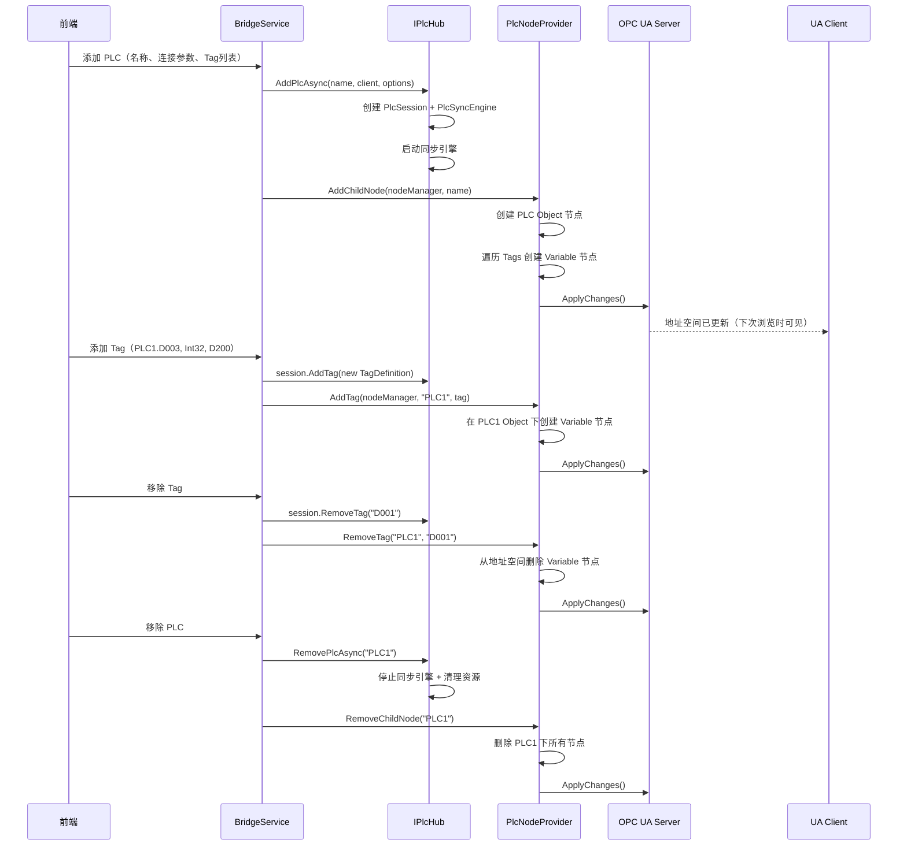

# 整体架构与数据流

## 系统分层

```
┌──────────────────────────────────────────────────────────────┐
│                       前端 (Vue 3)                            │
│  MainView → OPC UA 管理页 / PLC 管理页 / Lua 管理页          │
│                     │                                        │
│              Bridge API (HTTP)                                │
└─────────────────────┬────────────────────────────────────────┘
                      │
┌─────────────────────▼────────────────────────────────────────┐
│              VitrinRuntime.Desktop (net8.0)                  │
│                                                              │
│  ┌──────────────┐  ┌────────────────┐  ┌──────────────────┐ │
│  │ OPC UA Server│  │ BridgeService  │  │ LuaEngineService │ │
│  │ (Opc.Ua SDK) │  │ (REST API)     │  │ (脚本管理)       │ │
│  │              │  │                │  │                  │ │
│  │ VitrinNode   │  │ OpcUaServer    │  │ LuaEventBridge   │ │
│  │ Manager      │  │ Service        │  │ LuaPlatformApi   │ │
│  └──────┬───────┘  └───────┬────────┘  └──────────────────┘ │
│         │                  │                                 │
│         └──────────┬───────┘                                 │
│                    │                                          │
│  ┌─────────────────▼────────────────────────────────────────┐│
│  │                 IPlcHub                                  ││
│  │   PLC1 (IPlcSession)  │  PLC2 (IPlcSession)             ││
│  └───────────────────────┴──────────────────────────────────┘│
│                    │                                          │
│  ┌─────────────────▼────────────────────────────────────────┐│
│  │  IPlcClient (协议层)                                     ││
│  │  Mitsubishi │ Omron │ Modbus │ Siemens │ 外部扩展        ││
│  └──────────────────────────────────────────────────────────┘│
└──────────────────────────────────────────────────────────────┘
```

## 数据流路径

### 路径 1：OPC UA Client 读取 Tag 值

```
UA Client
  │ Read Request (PLC1.D001)
  ▼
OPC UA Server
  │ VitrinNodeManager 路由到 PlcNodeProvider
  ▼
PlcNodeProvider.readFunc()
  │ session.Get<object>("D001")
  ▼
PlcMemoryMirror.Read<T>(tag)
  │ 直接从内存 BufferSlice 解码返回值
  ▼
返回 PlcCodec.Read<Int32>(data, addr, endian)
  → OPC UA Variable.Value = 150
  → Reply to UA Client
```

**耗时：~0.01ms（纯内存操作，零网络）**

### 路径 2：OPC UA Client 写入 Tag 值

```
UA Client
  │ Write Request (PLC1.D001 = 200)
  ▼
OPC UA Server
  │ VitrinNodeManager → PlcNodeProvider.writeFunc(200)
  ▼
PlcNodeProvider.writeFunc
  │ Task.Run(async () => await session.SetAsync("D001", 200))
  ▼
PlcSession.SetAsync<object>("D001", 200)
  │ PlcCodec.Encode(200, Int32, endian)
  │ _client.WriteBytesAsync(address, bytes)
  ▼
Mitsubishi/Omron Client → 物理 PLC
  │ PLC 内存变更 → 下次扫描读回 → 确认
  ▼
PlcSyncEngine 扫描周期 → 发现变化
  → ChangeNotifier.NotifyChanges(...)
  → GeneralEventBus.Default.Publish(new TagValueChangedEvent{...})
  → Lua 脚本（如果订阅了 OnTagValueChanged）
  → OPC UA Variable 值在下次 Read 时返回新值
```

### 路径 3：进程内直接操作节点

```
管理界面（前端）
  │ 用户输入新值 200
  ▼
Bridge API → OpcUaServerService.WriteNodeValue(...)
  │
  ├── 方案 A（写 PLC，推荐）:
  │     session.SetAsync("D001", 200)
  │     → 同上路径 2，等待扫描确认
  │
  └── 方案 B（仅改内存，模拟）:
        variable.Value = 200
        VitrinNodeManager.ApplyChanges()
        → OPC UA Server 立即通知所有 MonitoredItem 订阅者
        → 不写 PLC，值在下次扫描时会被覆盖
```

### 路径 4：DataChange 通知

```
PlcSyncEngine 扫描发现变化
  │ change = (tag, oldVal, newVal)
  ▼
ChangeNotifier.NotifyChanges([change1, change2, ...])
  │
  ├── 订阅链路 1: IPlcSession.Subscribe → 进程内回调
  │
  ├── 订阅链路 2: GeneralEventBus.Default.Publish(TagValueChangedEvent)
  │     ├── TagValueChangedFrontendHandler → Bridge → 前端
  │     ├── TagValueChangedHistoryHandler → 历史记录
  │     └── LuaEventBridgeService → Lua OnTagValueChanged
  │
  └── OPC UA 链路（通过 readFunc）:
        UA Client 通过 MonitoredItem 订阅了 Variable
        OPC UA Server 采样循环（默认 500ms）检查 Variable 值
        发现变化 → 推送 Notification 到 UA Client
```

## Tag 值变更的 OPC UA 通知延迟

| 方式 | 延迟 | 说明 |
|------|------|------|
| 进程内直接改 `Variable.Value` + `ApplyChanges()` | ~1ms | 适用模拟/测试场景 |
| 通过 PLC 扫描发现 | ~200ms~2s | 取决于扫描间隔，值与 PLC 一致 |
| OPC UA 采样周期 | 配置可调，默认 500ms | Server SDK 内置，无需额外代码 |

## 地址空间动态管理时序


